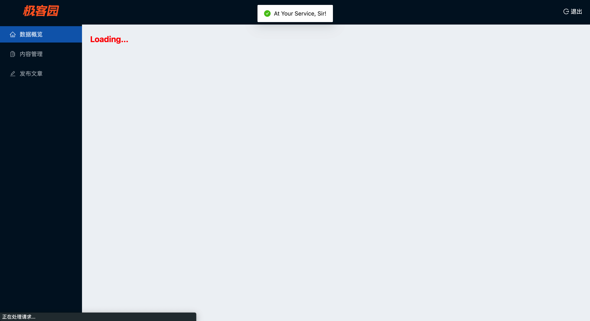
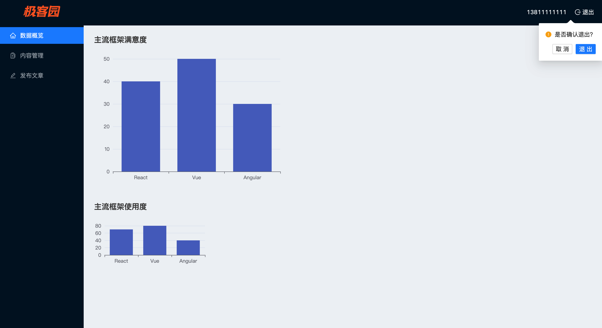
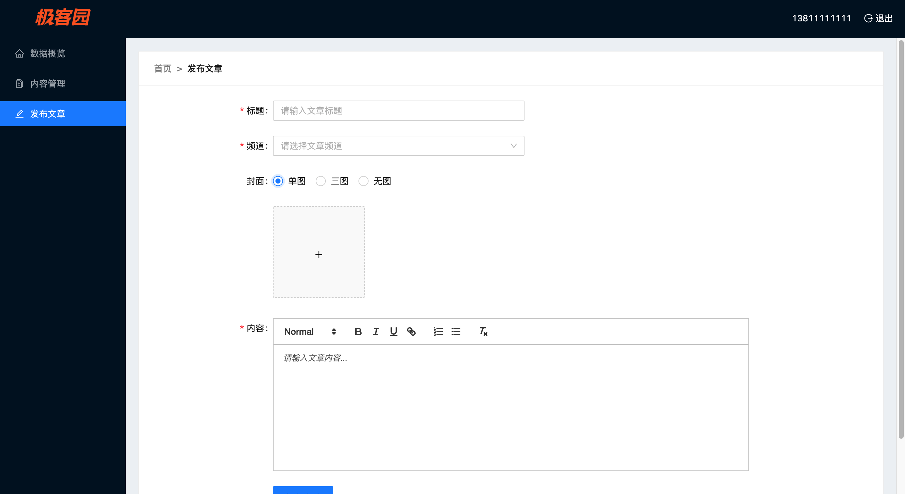

<div align="center">
  
</div>
<h4 align="center">
    😎开 箱 即 用 的 技 术 博 客 平 台 —— 极 客 园.
</h4>


### `项目介绍`

React_Geek_PC是一个基于React Hooks + antD + axios + react-router-dom v6 + Mobx + history 的pc前端项目。


项目接口地址：http://geek.itheima.net/v1_0 。具体axios配置可在/src/utils/http.js中查看。

项目学习博客：[CodeMak1r.的博客](https://blog.csdn.net/Svik_zy?spm=1000.2115.3001.5343) 。可在【React--从基础到实战】专栏中学习🤩。


### `项目启动`


**安装依赖**

`yarn install`，您可能需要提前安装：[yarn包管理器](https://www.yarnpkg.cn/)。


**启动**

```
yarn start  // for windows with craco
sudo yarn start  // for macOS with craco
```


**打包**

```
yarn build  // for windows with craco
sudo yarn build  // for macOS with craco
```


**上线后项目本地预览**（需本地全局安装server服务包）

```
serve -s ./build
```


**项目打包体积分析**

```
yarn analyze  // for windows with source-map-explorer
sudo yarn analyze  // for macOS with source-map-explorer
```


### `使用的插件/库`

- `JavaScript`
- React 官方脚手架 `create-react-app`
- react hooks  v18.2.0
- 状态管理：mobx  v6.6.1  /  mobx-react-lite  v3.4.0
- UI 组件库：`antd` v4
- ajax请求库：`axios`  v0.27.2
- 路由：`react-router-dom` v6 以及 `history` v5.3.0
- 富文本编辑器：`react-quill `v2.0.0
- 进度条：nprogress v0.2.0
- CSS 预编译器：`sass`
- 75CDN静态资源库
- 等等


### `项目结构`

```
React_Geek_PC
node_modules           // 项目依赖
build                  // 构建生成的静态文件目录
public                 // 静态文件资源
src                    // 项目源码目录
├─App.jsx              // 根组件
├─index.js             // 项目开发入口文件
├─index.scss           // 全局scss样式文件
├─utils                // utils工具库文件
|   ├─history.js          // history路由文件
|   ├─http.js             // 封装axios
|   ├─index.js            // utils入口文件
|   └token.js             // 封装sessionStorage存取token
├─styles               // 样式文件夹
|   └index.scss           // 全局样式
├─store                // 全局组件数据共享
|   ├─channel.Store.js    // channel组件数据
|   ├─index.js            // store入口文件
|   ├─login.Store.js      // login组件数据
|   └user.Store.js        // user组件数据
├─routes               // 路由表文件夹
|   └index.js             // 路由入口文件
├─pages                // 路由组件文件夹 
|   ├─Publish             // Publish路由组件
|   |    ├─index.jsx
|   |    └index.scss
|   ├─Login               // Login路由组件
|   |   ├─index.jsx
|   |   └index.scss
|   ├─Layout              // Layout路由组件
|   |   ├─index.jsx
|   |   └index.scss
|   ├─Home                // Home路由组件
|   |  ├─index.jsx
|   |  └index.scss
|   ├─Article             // Article路由组件
|   |    ├─index.jsx
|   |    └index.scss
├─hooks                 // 自定义hook
├─components            // 一般组件文件夹
|     ├─Loading           // Loading for Suspense
|     |    └index.jsx
|     ├─Bar               // 存放echarts实例
|     |  └index.jsx
|     ├─AuthRoute         // 路由鉴权
|     |     └index.jsx
├─assets                // 静态资源文件夹
|   ├─chart.png           
|   ├─error.png
|   ├─login.png
|   └logo.png
├── craco.config.js     // webpack等构建相关配置
|-- jsconfig.json       // 配置@-alias路径别名智能提示
├── .gitignore
├── package-lock.json
├── package.json
├── README.md
```


### `项目运行截图`

|||
|--|--|
|||
|||
|||


